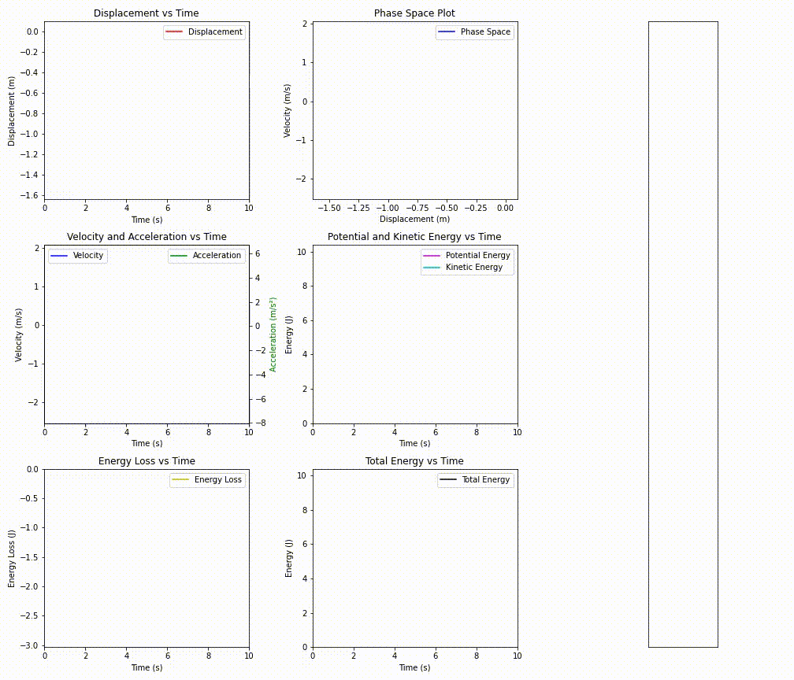
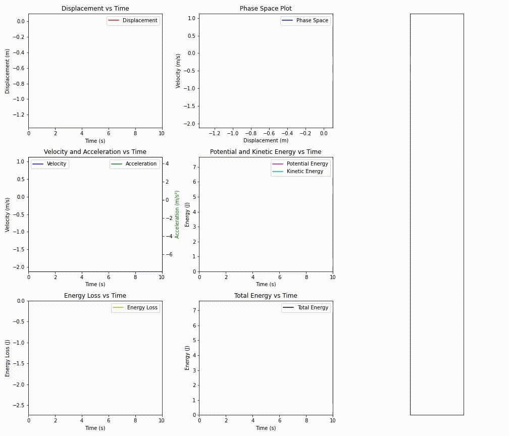

---

# README: Animation and Spring-Mass Systems

## Overview
This document details the mathematical foundations and Python implementation of animation and spring-mass systems, which are widely used in physics and computer graphics.

### Animation System
- **Description**: This system analyzes and visualizes the motion of objects over time.
- **Key Concepts**: 
  - Motion interpolation
  - Timeline and animation loop management

### Spring-Mass System
- **Description**: The spring-mass system is a physical model where a mass is attached to a spring, encompassing concepts like harmonic motion and damping.
- **Key Concepts**: 
  - Harmonic motion
  - Spring constant and mass
  - Damping and resonance

## Mathematical Foundations
The fundamental mathematical concepts necessary for understanding these systems are:

1. **Newton's Second Law of Motion**: `F = ma` (Force = mass x acceleration)
2. **Harmonic Motion**: The basic equation for the spring-mass system is `m·y'' + k·y = 0`.
3. **Damping**: Damping refers to the dissipation of energy through friction or other processes, represented by the equation `m·y'' + c·y' + k·y = 0`.
4. **Resonance**: At the system's natural frequency, when the frequency of the applied force matches, maximum amplitude is achieved.

## Implementation and Libraries
The necessary steps and libraries for simulating these systems in Python:

2. **NumPy**: A library for scientific computations. It can be installed with the command `pip install numpy`.
3. **Matplotlib**: Used for drawing graphs. Installable with `pip install matplotlib`.
4. **SciPy**: Provides advanced tools for scientific calculations. Install with `pip install scipy`.

  

  

